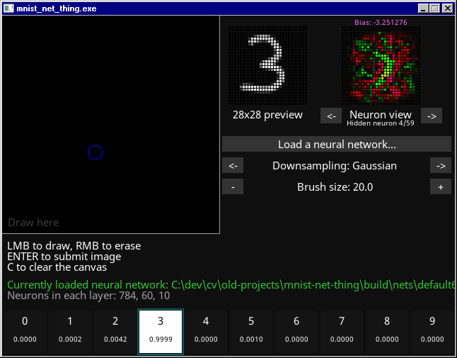

# recognizing handwritten digits
A homemade neural network implementation from 2019. 
This was me trying to learn about how neural networks work.

Contaminated with CMake & reuploaded to github.com/311Volt in 2022.

# complete with:

* a bad homemade neural network class
* a MNIST dataset reader used to train the network
* a convenient GUI where you can draw a digit and send the image to the neural network

# GUI features

* a 308x308 drawing canvas
* can load a custom neural network from a file
* shows the exact output from the network
* automatic real-time image downscaling to 28x28, featuring:
  - image centering using the same rules by which MNIST images were centered
  - high-quality downsampling
* a visualization of the first hidden layer of the network being used (green=positive, red=negative)
